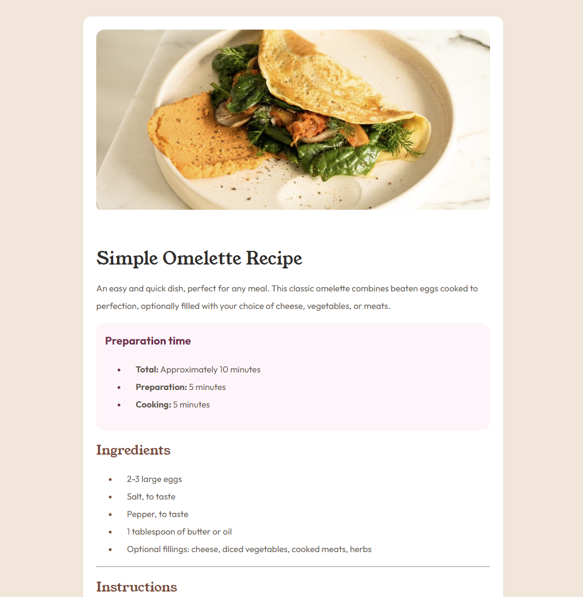
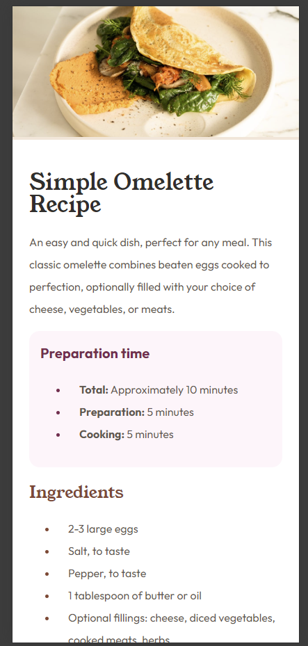

# Frontend Mentor - Recipe page solution

This is a solution to the [Recipe page challenge on Frontend Mentor](https://www.frontendmentor.io/challenges/recipe-page-KiTsR8QQKm).

## Table of contents
  - [The challenge](#the-challenge)
  - [Screenshot](#screenshot)
  - [Links](#links)
  - [Built with](#built-with)
  - [What I learned](#what-i-learned)
  - [Continued development](#continued-development)
  - [Author](#author)

### The challenge

The challenge was to build out the recipe page and get it looking as close to the design as possible using HTML and CSS.

### Screenshot

- 
- 

**Note: Delete this note and the paragraphs above when you add your screenshot. If you prefer not to add a screenshot, feel free to remove this entire section.**

### Links

- Solution URL: [Add solution URL here](https://www.frontendmentor.io/solutions/mobile-first-solution-using-html-and-css-ywKn1dMy6D)
- Live Site URL: [Add live site URL here](https://nastashacloser.github.io/recipe-page-main/)

### Built with

- Semantic HTML5 markup
- CSS custom properties
- Mobile-first workflow

### What I learned

I learned how to structure a stylesheet for a mobile-first project. This project gave me the opportunity to practice following a style guide.

### Continued development

This project allowed me to use more semantic HTML5 which I should practice with more to become more comfortable following best practices.

## Author

- Frontend Mentor - [@nastashaCloser](https://www.frontendmentor.io/profile/nastashaCloser)
